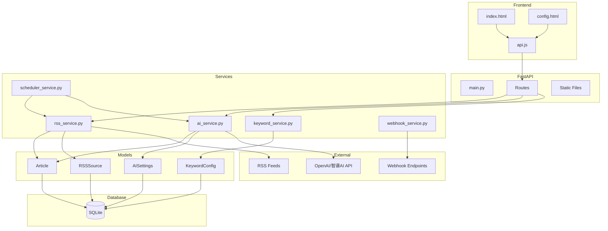

# Briefly 项目架构分析与优化建议

## 项目概述

**Briefly** 是一个 AI 驱动的 RSS 阅读器，具备以下核心功能：
- RSS 订阅管理与自动抓取
- 关键词过滤
- AI 文章摘要生成
- Webhook 推送通知

### 技术栈
- **后端**: FastAPI + SQLAlchemy ORM + SQLite (async)
- **RSS 解析**: feedparser
- **AI 服务**: OpenAI API (兼容智谱 AI)
- **定时任务**: APScheduler
- **前端**: Vanilla JS + Tailwind CSS

---

## 架构图



---

## 🔴 5 个最值得优化的问题

### 1. 性能瓶颈 - 文章列表查询效率低下

**位置**: [`app/routes/articles.py:73-114`](app/routes/articles.py:73)

**问题描述**:
```python
# 当前实现 - 执行两次查询
result = await db.execute(query)
articles = result.scalars().all()

total = len(articles)  # 在 Python 中计算总数，效率低

query = query.order_by(Article.published_at.desc())
query = query.offset((page - 1) * page_size).limit(page_size)

result = await db.execute(query)  # 第二次查询
articles = result.scalars().all()
```

**问题分析**:
- 执行了两次数据库查询
- 第一次查询获取所有匹配记录，然后在 Python 中计算 `len(articles)`
- 当文章数量增多时，内存消耗和响应时间会显著增加

**优化建议**:
```python
# 优化后 - 使用 SQL COUNT 查询
from sqlalchemy import func

# 计算总数 - 单独的 COUNT 查询
count_query = select(func.count(Article.id))
if conditions:
    count_query = count_query.where(and_(*conditions))
total_result = await db.execute(count_query)
total = total_result.scalar()

# 分页查询 - 只获取需要的数据
query = select(Article)
if conditions:
    query = query.where(and_(*conditions))
query = query.order_by(Article.published_at.desc())
query = query.offset((page - 1) * page_size).limit(page_size)
```

**影响**: 高 - 直接影响用户体验和服务器资源

---

### 2. 安全漏洞 - CORS 配置过于宽松

**位置**: [`app/main.py:52-58`](app/main.py:52)

**问题描述**:
```python
app.add_middleware(
    CORSMiddleware,
    allow_origins=["*"],  # 允许任何来源
    allow_credentials=True,
    allow_methods=["*"],
    allow_headers=["*"],
)
```

**问题分析**:
- `allow_origins=["*"]` 允许任何域名访问 API
- 结合 `allow_credentials=True` 是**危险配置**
- 容易受到 CSRF 攻击，恶意网站可以冒用用户身份调用 API

**优化建议**:
```python
# 从环境变量读取允许的域名
ALLOWED_ORIGINS = settings.ALLOWED_ORIGINS.split(",") if settings.ALLOWED_ORIGINS else ["http://localhost:8000"]

app.add_middleware(
    CORSMiddleware,
    allow_origins=ALLOWED_ORIGINS,
    allow_credentials=True,
    allow_methods=["GET", "POST", "PUT", "DELETE"],
    allow_headers=["Content-Type", "Authorization"],
)
```

**配置文件更新**:
```env
# .env
ALLOWED_ORIGINS=http://localhost:8000,https://your-domain.com
```

**影响**: 高 - 安全风险

---

### 3. 过时的 API - FastAPI 事件处理器已弃用

**位置**: [`app/main.py:73-98`](app/main.py:73)

**问题描述**:
```python
@app.on_event("startup")  # 已弃用
async def startup_event():
    ...

@app.on_event("shutdown")  # 已弃用
async def shutdown_event():
    ...
```

**问题分析**:
- `on_event("startup")` 和 `on_event("shutdown")` 在 FastAPI 0.109+ 版本中已弃用
- 当前项目使用 `fastapi==0.109.0`，应该迁移到新的 `lifespan` API
- 弃用的 API 可能在未来版本中被移除

**优化建议**:
```python
from contextlib import asynccontextmanager

@asynccontextmanager
async def lifespan(app: FastAPI):
    # Startup
    logger.info("应用启动中...")
    if os.environ.get("TESTING") != "1":
        await init_db()
        logger.info("数据库初始化完成")
    scheduler.start()
    logger.info("定时任务调度器已启动")
    logger.info("应用启动完成")
    
    yield  # 应用运行中
    
    # Shutdown
    logger.info("应用关闭中...")
    scheduler.stop()
    logger.info("定时任务调度器已停止")
    logger.info("应用已关闭")

def create_app() -> FastAPI:
    app = FastAPI(
        title="Briefly API",
        lifespan=lifespan  # 使用新的 lifespan 参数
    )
    # ...
```

**影响**: 中 - 技术债务，未来兼容性问题

---

### 4. 代码冗余 - 重复的序列化逻辑

**位置**: 
- [`app/models/article.py:46-67`](app/models/article.py:46) - `Article.to_dict()`
- [`app/routes/articles.py:17-42`](app/routes/articles.py:17) - `article_to_dict()`

**问题描述**:

Model 中的 `to_dict()` 方法:
```python
# app/models/article.py
def to_dict(self):
    return {
        "id": self.id,
        "source_id": self.source_id,
        # ... 其他字段
        "description": self.description[:200] + "..." if self.description and len(self.description) > 200 else self.description,
        # ...
    }
```

路由中的 `article_to_dict()` 函数:
```python
# app/routes/articles.py
def article_to_dict(article: Article) -> dict:
    def fmt(dt):
        return dt.isoformat() if dt else None
    
    content_preview = None
    if article.content:
        content_preview = article.content[:200] + "..." if len(article.content) > 200 else article.content
    
    return {
        "id": article.id,
        "source_id": article.source_id,
        # ... 重复的字段
    }
```

**问题分析**:
- 两处代码实现几乎相同的功能
- 字段截断逻辑分散在不同位置
- 维护时需要同时修改两处，容易遗漏
- `to_dict()` 方法在 Model 中定义但未被使用

**优化建议**:
```python
# 方案1: 统一使用 Pydantic 的 model_validate
class ArticleResponse(BaseModel):
    model_config = ConfigDict(from_attributes=True)
    
    id: int
    source_id: int
    # ... 其他字段
    
    @staticmethod
    def truncate(text: Optional[str], max_len: int = 200) -> Optional[str]:
        if not text:
            return None
        return text[:max_len] + "..." if len(text) > max_len else text
    
    @classmethod
    def from_article(cls, article: Article) -> "ArticleResponse":
        return cls(
            id=article.id,
            source_id=article.source_id,
            content_preview=cls.truncate(article.content),
            # ...
        )

# 方案2: 删除 Model 中的 to_dict，只保留路由中的序列化函数
```

**影响**: 中 - 代码可维护性

---

### 5. 性能问题 - RSS 抓取使用同步 HTTP 客户端

**位置**: [`app/services/rss_service.py:117-150`](app/services/rss_service.py:117)

**问题描述**:
```python
def fetch_rss_feed(source: RSSSource) -> List[Dict]:
    # 使用同步客户端
    try:
        with httpx.Client(timeout=settings.REQUEST_TIMEOUT) as client:
            response = client.get(source.url, follow_redirects=True)
            response.raise_for_status()
    except httpx.TimeoutException:
        raise RSSNetworkError(f"请求超时: {source.url}")
    # ...
```

**问题分析**:
- `fetch_rss_feed` 是同步函数，使用 `httpx.Client`
- 在异步调度器中被调用时会阻塞事件循环
- 当有多个 RSS 源时，抓取是串行执行的
- [`scheduler_service.py:67`](app/services/scheduler_service.py:67) 中的 `fetch_rss_task` 是 async 函数，但调用了同步的 `fetch_rss_feed`

**优化建议**:
```python
# 改为异步实现
async def fetch_rss_feed(source: RSSSource) -> List[Dict]:
    logger.info(f"开始抓取 RSS 源: {source.name} ({source.url})")
    
    try:
        async with httpx.AsyncClient(timeout=settings.REQUEST_TIMEOUT) as client:
            response = await client.get(source.url, follow_redirects=True)
            response.raise_for_status()
    except httpx.TimeoutException:
        raise RSSNetworkError(f"请求超时: {source.url}")
    # ...

# 并发抓取多个源
async def fetch_and_save_all_sources(db: AsyncSession) -> Dict[int, int]:
    result = await db.execute(select(RSSSource).where(RSSSource.enabled == True))
    sources = result.scalars().all()
    
    # 并发抓取所有源
    tasks = [fetch_rss_feed(source) for source in sources]
    results = await asyncio.gather(*tasks, return_exceptions=True)
    # ...
```

**影响**: 高 - 性能瓶颈，尤其当 RSS 源数量增加时

---

## 优化优先级总结

| 优先级 | 问题 | 类型 | 影响 |
|--------|------|------|------|
| 🔴 P0 | CORS 安全漏洞 | 安全 | 高 - 生产环境风险 |
| 🔴 P0 | 文章列表查询效率 | 性能 | 高 - 用户体验 |
| 🟡 P1 | RSS 同步抓取 | 性能 | 高 - 扩展性 |
| 🟡 P1 | FastAPI 弃用 API | 技术债务 | 中 - 未来兼容性 |
| 🟢 P2 | 序列化代码冗余 | 可维护性 | 中 - 代码质量 |

---

## 其他发现

### 潜在问题
1. **数据库路径硬编码**: [`app/models/database.py:5`](app/models/database.py:5) 中 `DATABASE_URL` 被硬编码，虽然 `config.py` 中有配置，但实际使用的是硬编码值
2. **日志配置重复**: 多个文件中都有 `logging.basicConfig()`，应该集中配置
3. **缺少数据库索引**: `Article` 表缺少 `(source_id, published_at)` 复合索引

### 优点
- 清晰的项目结构
- 良好的异步数据库支持
- 完善的错误处理和自定义异常
- 支持 Docker 部署
